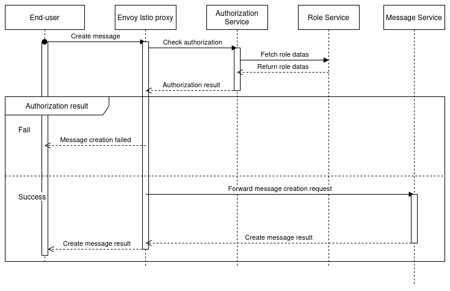

= Security 

link:https://www.redhat.com/fr/topics/microservices/what-is-a-service-mesh[What is a service mesh?]

link:https://konghq.com/blog/learning-center/what-is-a-service-mesh[What is an service mesh (kong)?]

link:https://www.youtube.com/watch?v=16fgzklcF7Y[Service mesh with Istio and nana]

link:https://www.youtube.com/watch?v=voAyroDb6xk[Implement service mesh with Istio and nana]

link:https://konghq.com/blog/learning-center/what-is-an-api-gateway/[What is an API Gateway?]

link:https://konghq.com/blog/learning-center/api-gateway-authentication[Api gateway authentication]

link:https://dev.to/aviyel/what-is-authorization-service-and-why-does-it-matter-5d9d[What is an authorization service and why does it matter?]

link:https://chat.mistral.ai/chat/6c436864-81f0-47a3-a8b2-678c2b420df1[Chat with the Mistral AI team]

link:https://istiobyexample.dev/grpc/[gRPC with Istio]

link:https://istio.io/latest/docs/setup/in stall/helm/[Install Istio with Helm]

== OPA

link:https://www.openpolicyagent.org/docs/latest/envoy-tutorial-istio/[Envoy tutorial with Istio to enforce authorization]

link:https://www.openpolicyagent.org/docs/latest/external-data/#flow-1[External data with OPA]

link:https://www.youtube.com/watch?v=jY9clB5b3hY&list=WL&index=2[OPA with Envoy cncf]

== Service mesh

Main concepts:
A proxy is a sidecar container that intercepts all incoming and outgoing traffic to the service.

It allows to add features like:
- Load balancing
- Service discovery
- Circuit breaking
- Rate limiting
- Observability

Always have a health check
Added retry logic
Big advantage is that we don't need to implement network logic in the application
Easily do canary deployments (90 of traffic on the new version of the application and 10 on the old one)

With istio the new service added to the clutser is automatically added to the service mesh
mTls is a must have in a service mesh
itio implements gateway


== How do I manage the authentication system with an OIDC?

There are severals authentication protocols like:
- OAuth2
- OIDC
- SAML
- LDAP
- Kerberos 

These are normally used to authenticate users in a system. We will try to choose wisely in order. To help us with that we will try to enumerate the requirements of the system.
As any system needs

== Implications of Authentication in a Microservices Application

Authentication in a microservices application has several implications:

1. **Decentralized Authentication**: Each microservice may need to handle authentication independently, which can lead to inconsistencies and increased complexity. A centralized authentication service or gateway can help manage this.

2. **Token Management**: Microservices often rely on tokens (e.g., JWT) for authentication. Proper token management, including issuance, validation, and expiration, is crucial to ensure security.

3. **Inter-Service Communication**: When microservices communicate with each other, they need to authenticate requests. This can be achieved using mutual TLS (mTLS) or token-based authentication.

4. **Scalability**: Authentication mechanisms must be scalable to handle a large number of requests. This includes efficient token validation and minimizing the performance impact on microservices.

5. **Security**: Ensuring secure transmission of authentication credentials and tokens is essential. This includes using HTTPS, secure storage of secrets, and regular security audits.

6. **User Experience**: A seamless authentication experience is important for users. Single Sign-On (SSO) can help provide a unified authentication experience across multiple microservices.

7. **Compliance**: Adhering to regulatory requirements (e.g., GDPR, HIPAA) for authentication and user data management is critical in many industries.

By carefully considering these implications, you can design a robust and secure authentication system for your microservices application.


=== Authorization

Authorization is the process of determining what actions a user is allowed to perform within a system. It involves enforcing access control policies based on the user's identity, roles, and permissions. 

In the case of beep we will need to authorize the user at different levels and therefore we will need fine grained authorization.
A user can endorse different global roles such as:

- ApplicationAdministrator
- UserAdministrator
- ServerAdministrator

Also, with the right permission users will be able to create role in a server.
Those role will be linked to permissions to perform different actions on the resouces of the server (ex: Members, Channels ...).

This service will be called each time a user wants to perform an on a resource across the application. We need a reliable service that will allow to be called from any service in the application.

Different project could be useful and could implements different authorization policies.

Few technologies can help us to implement the authorization service:

- OPA
- Keycloak
- Permify
- Casbin

== Keycloak
Keycloak provide a complex authorization system that can be used to manage the authorization of the user in the application. For exemple we can define a role that can perform any action on any subject (channels, webhooks, etc.) in the application.

== OPA
OPA is a general-purpose policy engine that can be used to enforce fine-grained authorization policies in microservices applications. 
It can be integrated with Istio to enforce access control based on attributes of the request.

== Permify
Permify is a permission management system that can be used to define and enforce access control policies in microservices applications.
It provides a flexible and scalable solution for managing permissions and roles.

You can define entities, relation and schema to manage the permissions of the user in the application.
You can interact with the api using Grpc or Rest with Go or NodeJs.

Drawbacks:
- Having to maintain the schema of the entities
- Having to maintain the relation between the entities


== Casbin
Casbin is a powerful and efficient open-source access control library for Golang projects. It supports various access control models, including RBAC, ABAC, and PBAC, and can be easily integrated into microservices applications.


.Create a message in a channel of a server


Example plan for keycloak:

== Authentication with Keycloak and Istio

=== Introduction
Authentication is a critical aspect of any microservices architecture. In this document, we will discuss how to integrate Keycloak for authentication and use Istio to enforce authentication policies at the gateway level.

=== Keycloak Overview
Keycloak is an open-source identity and access management solution. It provides features such as single sign-on (SSO), user federation, and social login. Keycloak is a suitable choice for our application due to its robust authentication capabilities and ease of integration with microservices.

=== Istio Overview
Istio is a service mesh that provides a uniform way to secure, connect, and observe microservices. It enhances security by providing features such as mutual TLS (mTLS), traffic management, and policy enforcement.

=== Integration of Keycloak with Istio
In our architecture, Keycloak will handle user authentication and issue tokens. Istio will enforce authentication policies by verifying these tokens at the ingress gateway. This ensures that only authenticated requests are allowed to access the microservices.

=== Deployment Steps
1. **Deploy Keycloak**: Use the following YAML file to deploy Keycloak in your Kubernetes cluster.
    ```yaml
    apiVersion: apps/v1
    kind: Deployment
    metadata:
      name: keycloak
      namespace: keycloak
    spec:
      replicas: 1
      selector:
        matchLabels:
          app: keycloak
      template:
        metadata:
          labels:
            app: keycloak
        spec:
          containers:
          - name: keycloak
            image: jboss/keycloak:latest
            ports:
            - containerPort: 8080
    ```
2. **Configure Istio**: Use the following YAML file to configure Istio to work with Keycloak.
    ```yaml
    apiVersion: security.istio.io/v1beta1
    kind: RequestAuthentication
    metadata:
      name: keycloak-auth
      namespace: istio-system
    spec:
      selector:
        matchLabels:
          istio: ingressgateway
      jwtRules:
      - issuer: "https://keycloak.example.com/auth/realms/myrealm"
        jwksUri: "https://keycloak.example.com/auth/realms/myrealm/protocol/openid-connect/certs"
    ```

=== Authentication Flow
1. The user logs in through Keycloak and obtains a JWT token.
2. The user sends a request to the application with the JWT token.
3. The Istio ingress gateway intercepts the request and verifies the token.
4. If the token is valid, the request is forwarded to the appropriate microservice.

=== Security Considerations
- Ensure that all communication between services is encrypted using mTLS.
- Regularly update and rotate keys used by Keycloak and Istio.

=== Example Configuration
Refer to the provided YAML files for deploying Keycloak and configuring Istio.

=== Testing and Validation
1. **Test Keycloak**: Access the Keycloak admin console and create a test user.
2. **Validate Istio**: Send a request with a valid JWT token and verify that it is accepted. Send a request with an invalid token and verify that it is rejected.

=== Conclusion
By integrating Keycloak with Istio, we can ensure secure and efficient authentication for our microservices. This setup provides a scalable and manageable solution for handling authentication in a microservices architecture.


== Authorization in the Application

=== Introduction
Authorization is a critical aspect of any microservices architecture. In this document, we will discuss how to implement role-based access control (RBAC) within servers and global roles in our application. We will use tools like Keycloak, OPA, Permify, and Casbin to manage roles and permissions.

=== Role-Based Access Control (RBAC)
RBAC is a method of regulating access to resources based on the roles assigned to users. Roles are a grouping of permissions, and users can be assigned multiple roles. This approach simplifies the management of permissions and ensures that users have the appropriate access to resources.

=== Server-Specific Roles
In our application, each server can have its own set of roles. These roles define what actions users can perform within the server. For example, a user with the `VIEW_CHANNELS` role can see the channels and their contents, while a user with the `SEND_MESSAGES` role can send messages in the channels.

Example server-specific roles:
- `ADMINISTRATOR`: Can perform any action on any subject (channels, webhooks, etc.) in a server.
- `MANAGE_SERVER`: Can update a server (all CRUD operations except delete).
- `MANAGE_ROLES`: Can perform all CRUD operations on all roles.
- `CREATE_INVITATION`: Can create server invites.
- `MANAGE_CHANNELS`: Can perform all CRUD operations on every channel.
- `MANAGE_WEBHOOKS`: Can perform all CRUD operations on every webhook.
- `VIEW_CHANNELS`: Can see the channel and its contents (messages).
- `SEND_MESSAGES`: Can send messages on the channel.
- `MANAGE_NICKNAMES`: Can update other users’ nicknames.
- `CHANGE_NICKNAME`: Can update your own nickname.
- `MANAGE_MESSAGES`: Can delete other users’ messages.
- `ATTACH_FILES`: Can upload images and files.

=== Global Roles
Global roles apply across the entire application and have broader permissions. For example, an `ApplicationAdministrator` can perform any action on any subject in the application, including managing users, servers, and roles.

Example global roles:
- `ApplicationAdministrator`: Can perform any action on any subject (channels, webhooks, etc.) in the application.
- `UserAdministrator`: Can manage user accounts and permissions.
- `ServerAdministrator`: Can manage servers and their configurations.

=== Implementation Details
To implement server-specific roles and global roles, we will use Keycloak for managing user identities and roles, OPA for enforcing fine-grained authorization policies, Permify for defining and managing permissions, and Casbin for integrating access control models.

Example Keycloak configuration for defining roles:
```yaml
apiVersion: keycloak.org/v1alpha1
kind: KeycloakRealm
metadata:
  name: myrealm
spec:
  realm:
    realm: myrealm
    roles:
      realm:
        - name: ApplicationAdministrator
        - name: UserAdministrator
        - name: ServerAdministrator
      client:
        - clientId: myclient
          roles:
            - name: ADMINISTRATOR
            - name: MANAGE_SERVER
            - name: MANAGE_ROLES
            - name: CREATE_INVITATION
            - name: MANAGE_CHANNELS
            - name: MANAGE_WEBHOOKS
            - name: VIEW_CHANNELS
            - name: SEND_MESSAGES
            - name: MANAGE_NICKNAMES
            - name: CHANGE_NICKNAME
            - name: MANAGE_MESSAGES
            - name: ATTACH_FILES

```

=== Example Configuration 
Refer to the provided YAML files for defining roles and permissions in Keycloak. Additionally, configure OPA, Permify, and Casbin to enforce access control policies.

=== Testing and Validation

Test Keycloak: Access the Keycloak admin console and create test users with different roles.
Validate Authorization: Send requests with different roles and verify that the permissions are correctly enforced.
=== Conclusion 
By implementing role-based access control (RBAC) with server-specific roles and global roles, we can ensure secure and efficient authorization for our microservices. This setup provides a scalable and manageable solution for handling authorization in a microservices architecture. 