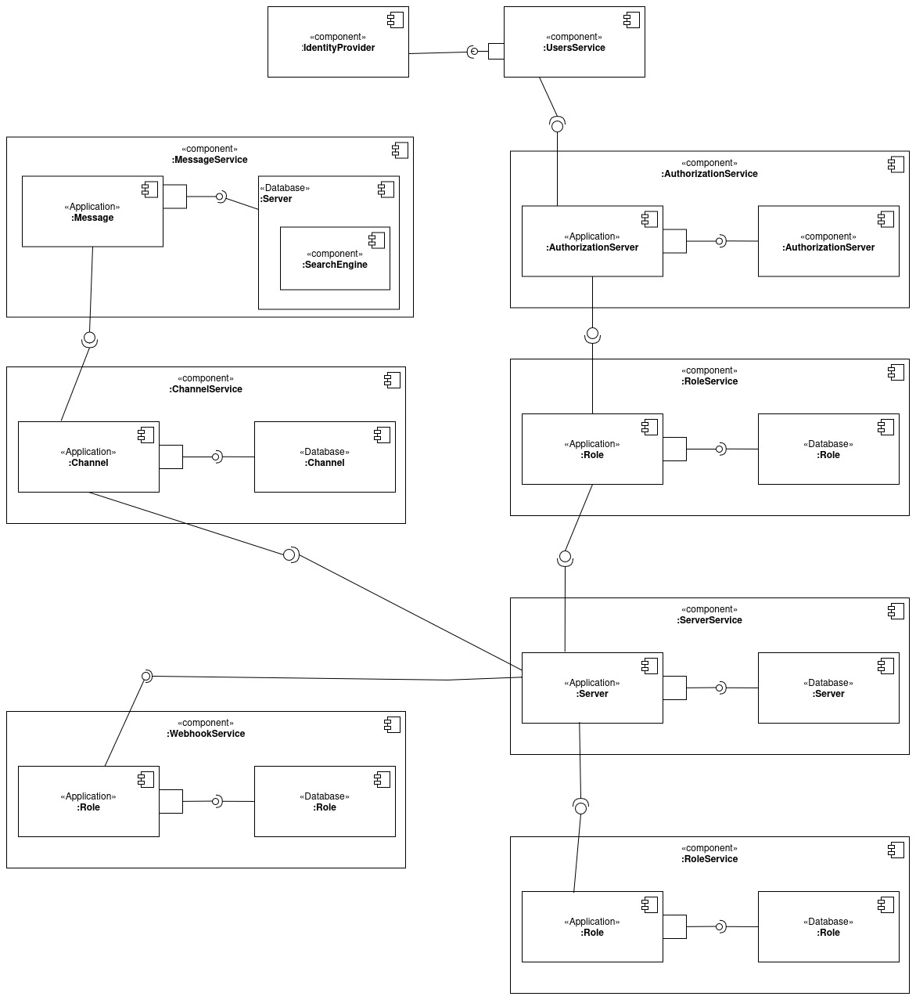

= Breaking down features

== Description

Beep as a lot of feature in a monolithic application. To make it easier to understand and maintain, we can break down the features into smaller parts.

== Break down

=== Profile

As a user of the application, I can create a profile with the following information:

* First name
* Last name
* Email
* Phone number
* Profile picture
* Status
* About

=== Authentication

As a user of the application, I can link my account to a Google account or an account that is reference in the Polytech LDAP.
As a user of the application, I can log out.

=== Private Conversation
As a user of the application: 

* I want to be able to create a private conversation with another user.
* I want to be able to send messages to another user in a private conversation.
* I want to be able to delete a private conversation with another user.
* I want to be able to initiate a call with another user in a private conversation.
* I want to be able to accept a call from another user in a private conversation.
* I want to be able to decline a call from another user in a private conversation.
* I want to be able to end a call with another user in a private conversation.
* I want to be able to search thrgouh the entire messages to find a message based on a keyword.

=== Friends
As a user of the application:

* I want to create invitation so that another user can be my friend.
* I want to decline invitation to be friend from another user.
* I want to accept an invitation to be friend with another user.
* I want to remove a friend from my friend list.

=== Servers Features

A server is an aggregation of channels, roles, and users that will be called members in that context.

Channels are used to separate conversations in a server. They can be text or voice channels.

Roles are used to manage permissions in a server. They can be assigned to a members.

Members can have different roles in a server. Their is a role by default called "BasicMember", and they can also be created.

Serveral permissions can be granted to roles:

* `ADMINISTRATOR`: Can perform any action on any subject (channels, webhooks, etc.) in a server.
* `MANAGE_SERVER`: Can update a server (all CRUD operations except delete).
* `MANAGE_ROLES`: Can perform all CRUD operations on all roles.
* `CREATE_INVITATION`: Can create server invites.
* `MANAGE_CHANNELS`: Can perform all CRUD operations on every channel.
* `MANAGE_WEBHOOKS`: Can perform all CRUD operations on every webhook.
* `VIEW_CHANNELS`: Can see the channel and its contents (messages).
* `SEND_MESSAGES`: Can send messages on the channel.
* `MANAGE_NICKNAMES`: Can update other users’ nicknames.
* `CHANGE_NICKNAME`: Can update your own nickname.
* `MANAGE_MESSAGES`: Can delete other users’ messages.
* `ATTACH_FILES`: Can upload images and files.

A role can have multiple permissions. A member can have multiple roles in the same server.  

As a user of the application:

* I want to be able to create a server.
* I want to be able to update a server.
* I want to be able to delete a server.
* I want to be able to list all the servers I am a member of.
* I want to be able to list all the servers I own.
* I want to be able to join a server.
* I want to be able to leave a server.
* I want to be able to create a role in a server.
* I want to be able to update a role in a server.
* I want to be able to delete a role in a server.
* I want to be able to list all the roles in a server.
* I want to be able to add a role to a member in a server.
* I want to be able to remove a role to a member in a server.
* I want to be able to list all the members in a server.
* I want to be able to list all the roles of a member in a server.
* I want to be able to list all the servers of a member.
* I want to be able to list all the channels of a server.
* I want to be able to create a channel in a server.
* I want to be able to update a channel in a server.
* I want to be able to delete a channel in a server.
* I want to be able to list all the messages of a channel.
* I want to be able to send a message in a channel.
* I want to be able to delete a message in a channel.
* I want to be able to list all the roles of a member in a server.
* I want to be able to list all the webhooks of a server.
* I want to be able to create a webhook in a server.
* I want to be able to update a webhook in a server.
* I want to be able to delete a webhook in a server.
* I want to be able to list all the permissions of a role in a server.
* I want to be able to add a permission to a role in a server.
* I want to be able to remove a permission to a role in a server.

=== Global Roles

A role is not necesseraliy linked to a server. It can be a global role. I would allow to have administator role that can perform any action on any subject (channels, webhooks, etc.) in the application. 

Roles would be:

- ApplicationAdministrator
- UserAdministrator
- ServerAdministrator

ApplicationAdministrator can perform any action on any subject (channels, webhooks, etc.) in the application. It implies that he will be inherit from all the abilities of the other roles.

== Neighborhood

As we saw some functionalities are related to each other. We can regroup them in functional parts. We will increment the application by adding these functionalities one by one from the less dependant to the most dependant.
We can extract from the use cases some entities that will be used in the application.

First of all, any person that want to access the application needs to be registered. We will need to have its profile information and the global permission. By default he has no role assigned.
This service should be reachable from anywhere in the application in order to acknowledge the user's permission.

=== Authorization

We will need to enforce the authorization of the user. We will need to have a service that will check if the user has the permission to perform an action. This service will be used in the whole application.

=== Communication

The communication will regroup anything that allow users to communicate with each other. 
Basically any message or vocal communication will be linked to a channel of the application.
Those channel can be assigned to server but in the case of private conversation users will have their own channel.

A service will be dedicated to messages. In order to validate 

=== Server

As we saw in the use cases, a server will regroup users and channels. The role associated to permission will allow manage the server entities.

Services:

- Users /
- Members /
- Roles /
- Authorization /
- Authentication /
- Servers /
- Channels /
- Messages /
- Webhooks /

.Overview of the application
