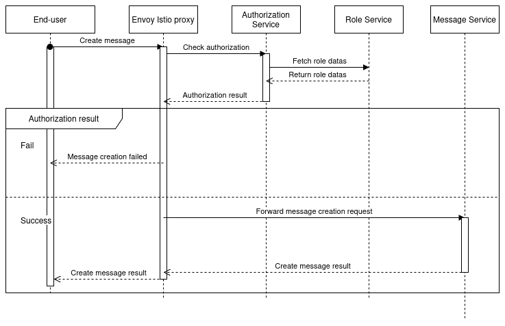

= Title of document
Hugo Ponthieu <hugopont08@gmail.com>
:description: Description of the document
:sectnums:
:toc: 
:title-page:

[abstract]
== Abstract

Beep is a chat application that allows users to communicate with each other in real-time.
The goal of this document is to provide an overview of the architecture of the application, including the services, protocols, and security mechanisms used to build the application.

Currently the application is developed in a monolithic way. As the features grow, the application is harder to maintain and scale. In fact, all the elements of the application can only be scaled together. Futhermore,  the application is not fault tolerant, if a service fails, the whole application will be down.

Those outage can be caused by high loads or network issues. It can also come from the development team that can introduce bugs in the application. The decoupling of responsibilities that offer microservices architecture will help to reduce the impact of a single component failure and let us to scale the application more easily.

== Global Architecture

=== Presentation 

=== Schema

.Overview of the application
image::services/beep-application_diagramme.svg[]

=== Security

==== Authentication

link:https://github.com/hugoponthieu/beep-front[Frontend integration of keycloak]

link:https://github.com/hugoponthieu/beep-api[Backend integration of keycloak]

===== Introduction
Authentication is a critical aspect of any microservices architecture. In this document, we will discuss how to integrate Keycloak for authentication to enforce authentication policies at the gateway level.

===== Keycloak Overview
Keycloak is an open-source identity and access management solution. It provides features such as single sign-on (SSO), user federation, and social login. Keycloak is a suitable choice for our application due to its robust authentication capabilities and ease of integration with microservices.

As the user should be able to authenticate with their email and password, with their google account and their Polytech account from an LDAP Keycloak is suited for this task.

The service allow the user to authenticate natively from frontend implementation by exposing the login page of Keycloak. The user will be able to authenticate with their email and password, with their google account and their Polytech account from an LDAP.

[red]#NOTE: SCREENSHOT OF THE KEYCLOAK GOOGLE#
[red]#NOTE: AUTHENTICATION WORKFLOW SEQUENCE DIAGRAM#

It will take the responsability to:

- Register new users in the application
- To issue tokens the user through diverser methods (email, google, LDAP)
- To check the validity of a token

===== OAuth2 Overview
OAuth2 is an authorization framework that enables applications to obtain limited access to user accounts on an HTTP service. It works by delegating user authentication to the service that hosts the user account and authorizing third-party applications to access the user account. This is done without exposing the user's credentials to the application.

OAuth2 is suitable for microservice applications because it provides a secure and standardized way to handle authentication and authorization across multiple services. By using OAuth2, microservices can delegate the responsibility of user authentication to a centralized identity provider, such as Keycloak, and focus on their core functionalities. This approach simplifies the management of user identities and access control in a distributed system.

===== In our architecture

For example if a user wants to access a resource on a service, the service will redirect the user to the authorization server (Keycloak) to authenticate the user. Once the user is authenticated, the server will issue an access token to the user, which can be used to access the resource. This token is short-lived and can be revoked at any time, providing an additional layer of security.

From the access token the user will be able to access the service. To enforce the check of the access token the service will use the introspection endpoint of the authorization server.

[red]#NOTE: SEQUENCE WORKFLOW FOR THE GATEWAY#

We have to note that all service will have an upstream gateway that will check the access token of the user before forwarding the request to the service. This will ensure that only authenticated users can access the services.

Although the user will maybe need to be known by the service, in order to perform some actions. For example, getting the the list of its friends or direct messages.
In that case the service will access directly the authorization server to get the user information.

===== Flows 

**Authorization Code Flow**: This flow is suitable for applications that can securely store client secrets. It involves exchanging an authorization code for an access token.

**Implicit Flow**: This flow is suitable for public clients, such as single-page applications, where the client secret cannot be securely stored. It involves directly obtaining an access token without an intermediate authorization code.

**Resource Owner Password Credentials Flow**: This flow is suitable for applications that have a high degree of trust with the user, such as first-party clients. It involves exchanging the user's credentials for an access token.

**Client Credentials Flow**: This flow is suitable for machine-to-machine communication, where the client is acting on its own behalf. It involves exchanging the client's credentials for an access token.

===== End-user authentication

The user will be able to authenticate with their email and password, with their google account and their Polytech account from an LDAP.

If the users try to access to the frontend wit

===== Deployment

[red]#NOTE: DEPLOYMENT SCHEME FOR THE KEYCLOAK IN CLUSTER#

==== Authorization

Authorization is a critical aspect of any microservices architecture. In this document, we will discuss how to implement role-based access control (RBAC) within servers and global roles in our application. 

===== Global Roles

Global roles are roles that are defined at the application level and apply to all services. They are typically used to define high-level permissions that are common across services.
In our application, we will define global roles such as `admin`, `moderator`, and `user`.
These roles will be used to enforce access control policies at the application level.

For this kind of roles we can use role based access control (RBAC) to define the permissions associated with each role. This will allow us to define fine-grained access control policies based on the user's role.

Then the role will be assiocated to users. The user granted with a role will be able to access the resources associated with the role.

The global wide role will be declared in the authorization server and will be used by the services to check the user's role.

**For example**

We can declare a "UserModerator" role that will have the abilities to:
- Restraint users from the application

We can declare "ServerModerator" role that will have the abilities to:
- Restraint users from a server
- Restraint users from a channel
- Restraint servers where users perform some actions that are not allowed

===== Server Roles

Server roles are roles that are defined at the server level and apply to a specific server. They are typically used to define permissions that are specific to a server.

Like in the global roles model we will have to define the fine grained access to control the access of the user to the resources of the server.

===== Permify

This service declare itself as Authorization as a Service. It will be used to manage the roles and the permissions of the users.

== Implementation

=== Deployment

==== Mesh Service

=== Protocols

link:https://github.com/hugoponthieu/hello-transport[Poc grpc with rust]

==== Inter-service communication

image::communication/beep-server-creation.svg[][]

==== Client communication

=== Services

==== Messages

===== Search

==== Users 

==== Members

==== Roles

==== Authorization

.Create a message in a channel of a server and check the authorization

==== Servers

==== Channels

==== Messages

==== Webhooks 

=== Backuping

=== Monitoring

